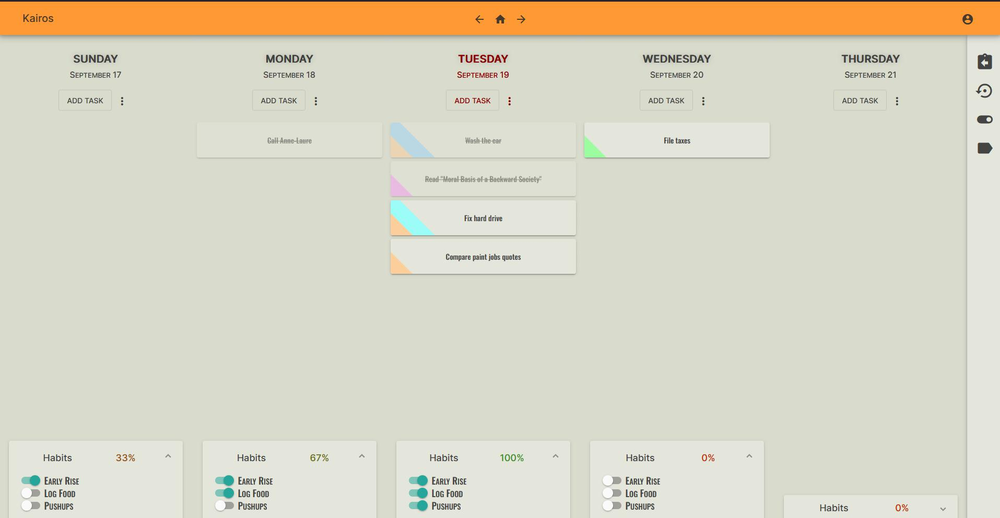
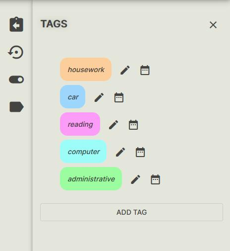

# Kairos

Kairos was a test project to explore web frameworks and toolkits. The Single-Page-Application was developped with *Angular*, *NgRx* and *Angular Material*.

The user interface is rather simplistic.

The application expects a small set of REST endpoints, even though I concluded that using gRPC or SignalR would better serve the needs of a cross-platform time keeping application.

## Features

Users can:

* add, edit and track daily habits
* add and edit tasks
* assign tags to tasks
* authenticate with a simple login and password combination through access tokens

## Screenshots

.Home

.Account Management

.Sign In

.Sign Up

.Day Menu

.Add Habit

.Add Habit

.Add Habit

.Habits Events

.Habits List

.Tag Edit

.Tags List

.Task Add

.Task Edit

.Task Events

.Unscheduled Tasks

## Development server

This project was generated with https://github.com/angular/angular-cli[Angular CLI] version 9.0.5.

Run `ng serve` for a dev server. Navigate to `http://localhost:4200/`. The app will automatically reload if you change any of the source files.

## Code scaffolding

Run `ng generate component component-name` to generate a new component. You can also use `ng generate directive|pipe|service|class|guard|interface|enum|module`.

## Build

Run `ng build` to build the project. The build artifacts will be stored in the `dist/` directory. Use the `--prod` flag for a production build.

## Running unit tests

Run `ng test` to execute the unit tests via https://karma-runner.github.io[Karma].

## Running end-to-end tests

Run `ng e2e` to execute the end-to-end tests via http://www.protractortest.org/[Protractor].

## Further help

To get more help on the Angular CLI use `ng help` or go check out the https://github.com/angular/angular-cli/blob/master/README.md[Angular CLI README].

## Serving Angular from IIS

Remember to copy `web.config` to the build directory, via appropriate configuration of the `angular.json` file, as in:

.web.config
----
<?xml version="1.0" encoding="utf-8"?>
<configuration>

<system.webServer>
  <rewrite>
    <rules>
      <rule name="Angular Routes" stopProcessing="true">
        <match url=".*" />
        <conditions logicalGrouping="MatchAll">
          <add input="{REQUEST_FILENAME}" matchType="IsFile" negate="true" />
          <add input="{REQUEST_FILENAME}" matchType="IsDirectory" negate="true" />
        </conditions>
        <action type="Rewrite" url="./index.html" />
      </rule>
    </rules>
  </rewrite>
</system.webServer>

</configuration>
----

Include `web.config` among the `assets` node of `architect/build`. This https://levelup.gitconnected.com/how-to-deploy-angular-app-to-an-iis-web-server-complete-setup-337997486423[page] provides additional insight.